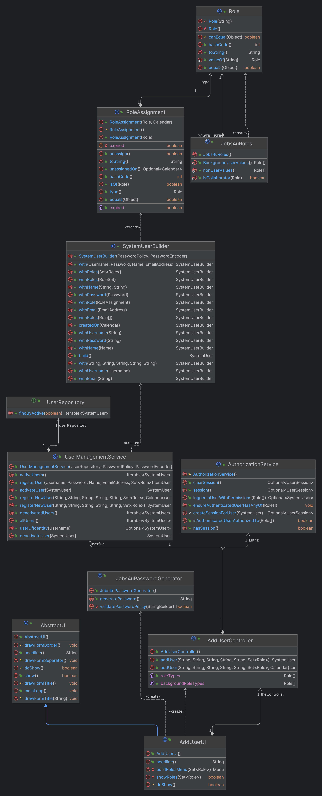
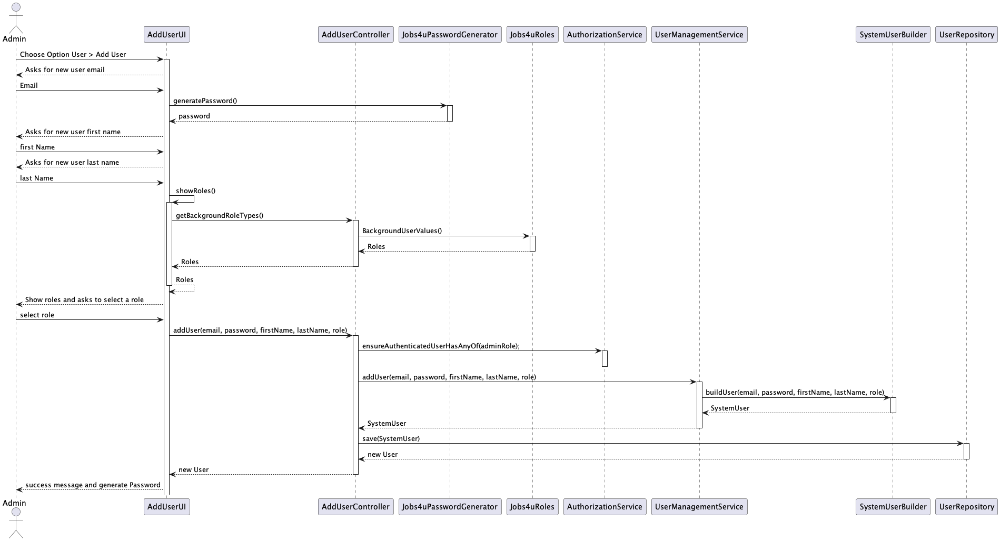

# UC 1000c

# 1. Requirements
**1000a** As Administrator, I want to be able to register users of the backoffice.

# 2. Analysis

## Client Meeting
- The Password should be automatically generated and sent to the users, but this last part is out of scope for this project.
- The password must correspond to the password policy of the company.

## Business Rules

- This US is directly related to the users of the backoffice.
- To add users of the backOffice, the user must be of the admin type.
- The user must have an email, name, and password.
- All the fields must be validated and the password must be generated according to the company's password policy.
- The user must be created in the enable state.
- Can't exist two users with the same email.

# 3. Design
- To implement this functionality, the team used the Controller and Repository pattern.
- Use the standard base structure of the layered application

## 3.1. Class Diagram

# 3.2. Sequence Diagram

# Test Plan

## Case #1: Add user successfully
1. Log in as admin
2. Choose the Option Users > Add user
3. Fill the email field
4. Fill the first name field
5. Fill the last name field
6. Choose a role
7. The system displays the password generated
8. Confirm the user created through List users (User > List Users)

## Case #2: Add user with same email
1. Log in as admin
2. Choose the Option Users > Add user
3. Fill the email field wih an email that already exists
4. Fill the first name field
5. Fill the last name field
6. Choose a role
7. The system displays an error message "That email is already in use."
8. Confirm the user was not created through List users (User > List Users)

## Case #3: Add user with invalid name
1. Log in as admin
2. Choose the Option Users > Add user
3. Fill the email field
4. Fill the first name field or the last name field with invalid characters
5. Choose a role
6. The system ends and displays an error message "That name inserted is invalid."
7. Confirm the user was not created through List users (User > List Users)

   