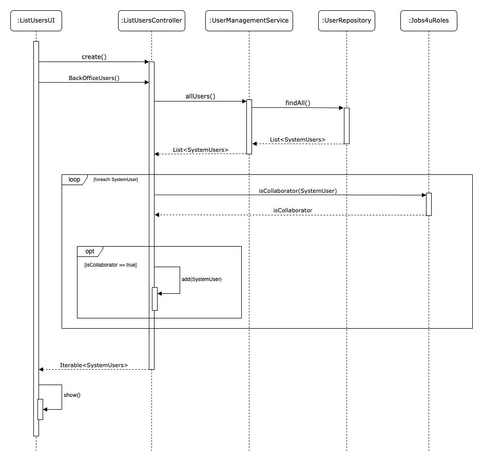

# US 1000c

## 1. Context

This task, identified as "US 1000c", is being assigned for the first time. The context for this task is to manage backoffice users in the system. As an Administrator, the user should be able to list all backoffice users.
## 2. Requirements

**1000c** As Administrator, I want to be able to list users of the backoffice.

**Dependencies/References:**

- Alternatively this can be achieved by a bootstrap process

## 3. Analysis
## Business Rules

- This US is directly related to the users of the backoffice.
- The listing of users only shows the users of the backoffice.
- The listing of users must show the user's name, email, status (enable or disable) and role.

## 4. Design

### 4.1. Realization

### 4.2. Class Diagram

### 4.3. Applied Patterns

In the development of this task, we utilized several design patterns to structure our code and ensure its maintainability and scalability. These patterns include:  
- **Repository Pattern:** The Repository pattern was used to create an abstraction layer between the data access layer and the business logic layer of the application. This helps to decouple the application and make it easier to maintain and test.  
- **Service Pattern:** The Service pattern was used to encapsulate business logic and rules. This pattern provides a set of methods that any client application can use, and these methods implement the business rules and logic.  
- **Controller Pattern:** The Controller pattern was used in the presentation layer of the application. Controllers handle incoming requests, manipulate data using the model, and select views to render to the user

### 4.4. Tests

#### Case #1: List User

1. Log in as admin
2. Choose the Option User > List users
3. Display all the users (email, name, status)

#### Case #2: List User (does not exist users)

1. Log in as admin
2. Choose the Option User > Enable User
3. Display a message "There are no users"

## 5. Implementation
The process of listing backoffice users in this system involves several components working together. Here's a step-by-step explanation:  
- **User Interface (ListUsersUI.java):** The user interface is responsible for displaying the list of backoffice users. It interacts with the ListUsersController to retrieve the list of users.  
- **Controller (ListUsersController.java):** The ListUsersController class is the bridge between the UI and the business logic. It uses the UserManagementService to retrieve the list of users.  
- **Service (UserManagementService.java):** The UserManagementService class is where the actual business logic for user management resides. It uses the UserRepository to interact with the database. When listing users, it retrieves all SystemUser objects from the database using the UserRepository.  
- **Repository (UserRepository):** The UserRepository is an interface that defines the methods for interacting with the database. It extends the DomainRepository interface, which provides methods for basic CRUD operations.
## 6. Integration/Demonstration

### Integration

We seamlessly integrated our functionality by leveraging an existing service that included both a repository and a controller. This approach allowed us to efficiently integrate our solution into the system without duplicating efforts or reinventing existing components.

### Demonstration

To demonstrate the functionality follow the steps below:

1. Log in as admin
2. Choose the Option User > List users
3. Display all the users (email, name, status)

This process demonstrates the system's ability to list backoffice users and display their email, name, and status. 

## 7. Observations

This listing only list backoffice users. The listing of users must show the user's name, email, and status (enable or disable) and role.