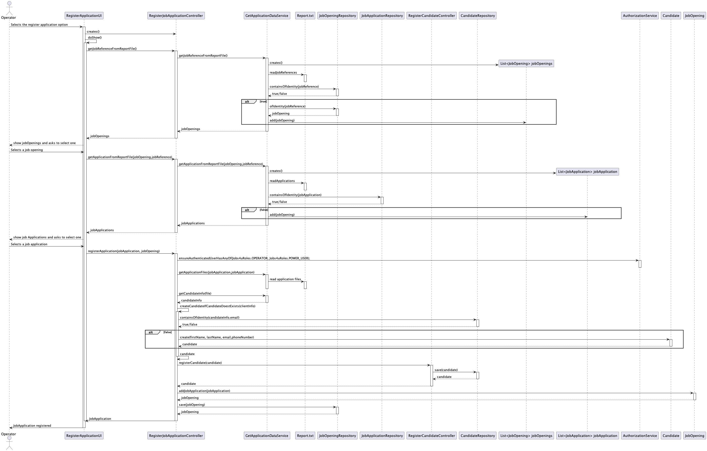
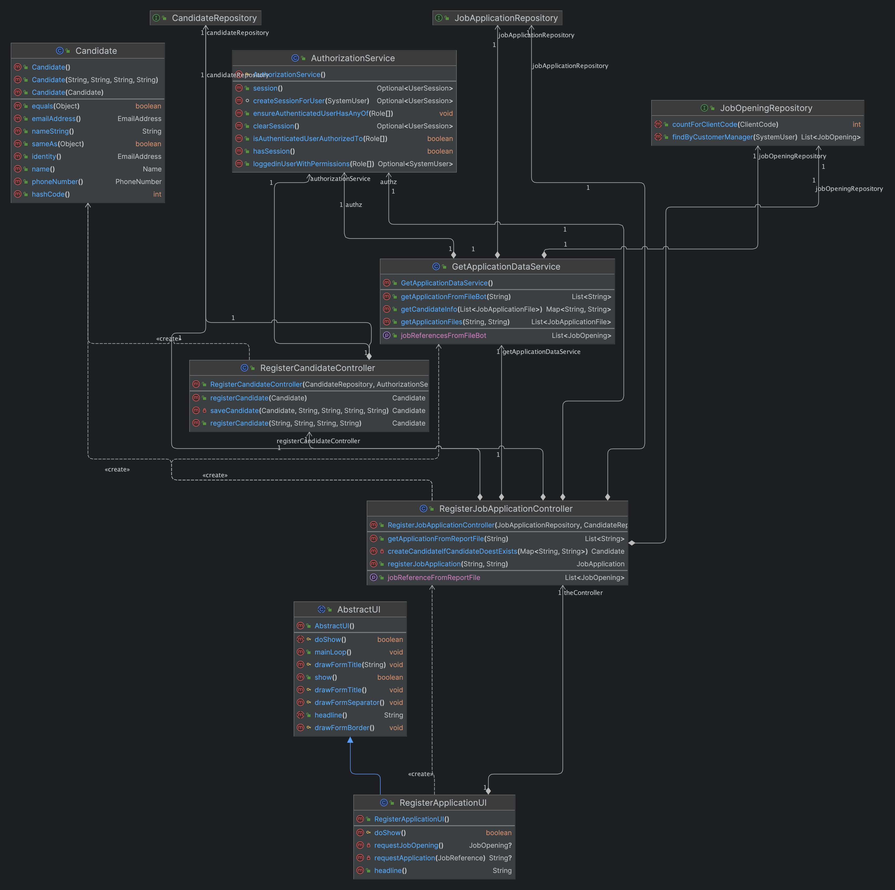

# US 2002

## 1. Context

This task, identified as "US 2002", is part of the job application management system. The context for this task involves enabling operators, specifically those acting as administrators, to register job applications for candidates and import associated files. This functionality ensures that operators can efficiently manage the application process and access relevant candidate data. Additionally, integrating with the Application File Bot ensures seamless file processing and storage in a shared location, facilitating collaboration and data access across the system.

## 2. Requirements

**US 1000a** As Administrator, I want to be able to register users of the backoffice.

**Dependencies/References:**

- Alternatively this can be achieved by a bootstrap process

## 3. Analysis

## Client Meeting
- The Password should be automatically generated and sent to the users, but this last part is out of scope for this project.
- The password must correspond to the password policy of the company.

## Business Rules

- This US is directly related to the users of the backoffice.
- To add users of the backOffice, the user must be of the admin type.
- The user must have an email, name, and password.
- All the fields must be validated and the password must be generated according to the company's password policy.
- The user must be created in the enable state.
- Can't exist two users with the same email.

## 4. Design

### 4.1. Realization

### 4.2. Class Diagram

### 4.3. Applied Patterns

In the development of this task, we utilized several design patterns to structure our code and ensure its maintainability and scalability. These patterns include:  
- **Builder Pattern:** This pattern was used to construct complex objects step by step. It separates the construction of an object from its representation, allowing the same construction process to create different representations.  
- **Repository Pattern:** The Repository pattern was used to create an abstraction layer between the data access layer and the business logic layer of the application. This helps to decouple the application and make it easier to maintain and test.  
- **Service Pattern:** The Service pattern was used to encapsulate business logic and rules. This pattern provides a set of methods that any client application can use, and these methods implement the business rules and logic.  
- **Controller Pattern:** The Controller pattern was used in the presentation layer of the application. Controllers handle incoming requests, manipulate data using the model, and select views to render to the user

### 4.4. Tests

#### Test #1: Add user successfully
1. Log in as admin
2. Choose the Option Users > Add user
3. Fill the email field
4. Fill the first name field
5. Fill the last name field
6. Choose a role
7. The system displays a success message "User created successfully."
8. Confirm the user created through List users (User > List Users)

#### Test #2: Add user with same email
1. Log in as admin
2. Choose the Option Users > Add user
3. Fill the email field wih an email that already exists
4. Fill the first name field
5. Fill the last name field
6. Choose a role
7. The system displays an error message "That email is already in use."
8. Confirm the user was not created through List users (User > List Users)

#### Test #3: Add user with invalid name
1. Log in as admin
2. Choose the Option Users > Add user
3. Fill the email field
4. Fill the first name field or the last name field with invalid characters
5. Choose a role
6. The system ends and displays an error message "That name inserted is invalid."
7. Confirm the user was not created through List users (User > List Users)

## 5. Implementation
The process of registering a new user in this system involves several components working together. Here's a step-by-step explanation

- **User Interface (AddUserUI.java)**: The process starts in the AddUserUI class, which is responsible for interacting with the user. It prompts the user to enter the necessary information such as email, first name, last name, and role. This class uses the AddUserController to handle the business logic.  
- **Controller (AddUserController.java):** The AddUserController class is the bridge between the UI and the business logic. It uses the UserManagementService to register the new user. It also uses the Jobs4uPasswordGenerator to generate a password for the new user.  
- **Service (UserManagementService.java):** The UserManagementService class is where the actual business logic for user management resides. It uses the UserRepository to interact with the database. When a new user is registered, it creates a new SystemUser object and saves it to the database using the UserRepository.  
- **Repository (UserRepository):** The UserRepository is an interface that defines the methods for interacting with the database. It extends the DomainRepository interface, which provides methods for basic CRUD operations.  

## 6. Integration/Demonstration

### Integration

We seamlessly integrated our functionality by leveraging an existing service that included both a repository and a controller. This approach allowed us to efficiently integrate our solution into the system without duplicating efforts or reinventing existing components.

### Demonstration

To demonstrate the functionality and the handling of invalid inputs, follow the steps below:  
1. Start the application and log in as an admin.
2. Navigate to the Users section and select the option to Add a user.
3. In the form that appears, fill the required fields with valid information. 
4. Submit the form. The system displays a success message "User created successfully."
5. To confirm that the user was not created, navigate to the List Users section under Users. The new user with the invalid name should not appear in the list.

This process demonstrates the system's ability to validate user input and successfully create a user with valid details.

## 7. Observations

One observation to note is that the password generated for the new user is not displayed on the screen. The method by which the new user gains access to their password is currently out of the scope of this project. 