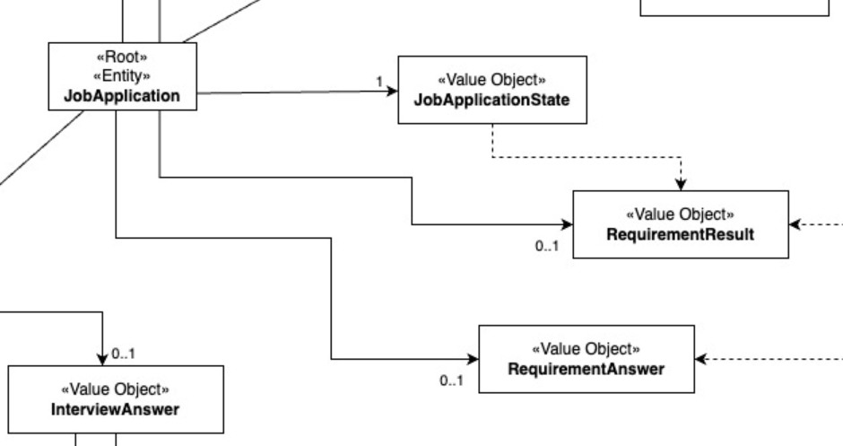
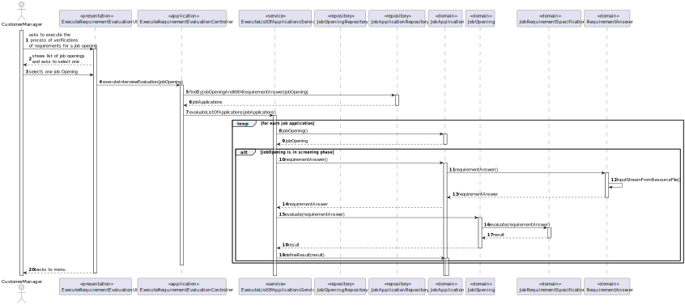

# US 1015

## 1. Context

This task, identified as "US 1015", is part of the Customer Manager feature. The goal of this task is to allow the customer manager to execute the process of verification of requirements of applications for a job opening.

## 2. Requirements

**1015** As Customer Manager, I want to execute the process of verification of requirements
of applications for a job opening.

**Dependencies/References:**

This user story have some dependencies with the following user stories:

| US                                                           | Reason                                                                                  |
|--------------------------------------------------------------|-----------------------------------------------------------------------------------------|
| [G007](../../SprintB/g007/readme.md)                         | We need the authentication to ensure is a customer manager that is logged.              | 
| [1002](../../SprintB/us1002/readme.md)                       | The job opening must be registered in the system.                                       |
| [1007](../../SprintB/us1007) [1010](../us1010/readme.md) | The job must must had received applications, so that one of the phases happened.        |
| [1009](../../SprintB/us1009/readme.md)                       | The job opening must have a requirement specification made for evaluation.              |
| [1013](../../SprintC/us1013/readme.md)                       | The job application of a job opening has an requirement answer (not necessary for all). |

- **NFR09 (LPROG) -> The support
  for this functionality must follow specific technical requirements, specified in LPROG.
  The ANTLR tool should be used (https://www.antlr.org/).**

## 3. Analysis

### 3.1. Client clarifications

- **Q69** Acerca da US 1016 - "As Customer Manager, I want the system to notify candidates, by email, of the result of the verification process" qual é o processo através do qual essa notificação é gerada? Após a avaliação do Requirement Specification module, este gera um resultado "Aprovado" ou "Rejeitado". Este resultado despoleta automaticamente uma notificação para o candidato ou é o Customer Manager que tem a responsabilidade de informar o candidato através do sistema do resultado da verificação (ex. depois de um resultado negativo ser gerado, o Customer Manager vai no sistema rejeitar o candidato para que seja enviado o email)?
- **A69** É a segunda opção que apresenta. A US1015 permite que o Customer Manager invoque o processo de verificação de requisitos. Depois disso todas as candidaturas devem estar aceites ou recusadas. É então possível ao Customer Manager invocar a notificação através da US1016.

- **Q167** Deve ser executado o processo para todos os candidatos ou apenas para alguns (segundo algum critério)?
- **A167** Os ficheiros com as respostas aos requisitos vão entrando no sistema gradualmente. Talvez seja mais “simples” que o processo execute (ou seja, faça a verificação dos requisitos) para os candidatos para os quais já foi submetido o ficheiro de requisitos. Nalgum momento o processo irá executar com todos os candidatos já com os ficheiros de requisitos submetidos.

- **Q210** This user story has a functional dependency with 1015. I would like to know if an error occurs, do I need to delete what happened in US 1015, as if it were a transaction?
- **A210** The process of notification (US1016) must be done after the verification (US1015) but an error in the notification does not invalidate the “results” of the verification process.

- **Q223** About the Us2004, in A180 you previously stated that "the Operator uploads a file with the requirements and the system should validate the file (verify of the syntax is correct). US 1015 is the one that executes the verification...". What should happen if the file failes this verification? Is the application instantly refused or do you have something else in mind?
- **A223** A file that fails the verification means that that file has an error (syntactic error) it does not mean that the application does not meet the requirements. The user should fix the error and submit again. Only US 1015 results in approving or rejecting an application.

### 3.2. Business Rules

- The job opening must be in screening phase.
- The process of verification is only made in job applications with requirement answers but without requirement result.
- The process of verification attribute a result to the application requirements. This result can be "Approved" or "Rejected".

### 3.3. System functionality

### 3.4. Domain Model

- This use case make a change in domain model, with the addiction of the requirement result connected to job application

## 4. Design

### 4.1. Realization

### 4.2. Domain Classes

- JobApplication
- JobOpening
- JobRequirementSpecification
- RequirementAnswer

### 4.3. Controller

- EvaluateRequirementEvaluationController

### 4.4. Service

- EvaluateListOfApplicationsService

### 4.4. Repository

- JobApplicationRepository

### 4.5. Class diagram

### 4.6. Applied patterns

In the development of this task, we utilized several design patterns to structure our code and ensure its
maintainability and scalability. These patterns include:

- **Repository Pattern:** The Repository pattern was used to create an abstraction layer between the data access layer
  and the business logic layer of the application. This helps to decouple the application and make it easier to maintain
  and test.
- **Service Pattern:** The Service pattern was used to encapsulate business logic and rules. This pattern provides a set of methods that any client application can use, and these methods implement the business rules and logic.
- **Controller Pattern:** The Controller pattern was used in the presentation layer of the application. Controllers
  handle incoming requests, manipulate data using the model, and select views to render to the user.

## 5. Implementation

he process of executing the process of verifying requirements in this system involves several components working together. Here's a step-by-step
explanation

- **User Interface (ExecuteRequirementEvaluationUI.java)**: The process starts in the ExecuteRequirementEvaluationUI class, which is
  responsible for interacting
  with the user. It prompts the user to enter the necessary information.
  This class uses the ExecuteRequirementEvaluationController to handle the business logic.
- **Controller (ExecuteRequirementEvaluationController.java):** The ExecuteRequirementEvaluationController class is the bridge between the
  UI and the business
  logic.
- **Service (ExecuteListOfApplicationsService.java):** The ExecuteInterviewEvaluationService class is where the business logic for execute the process of verifying requirements resides.
- **Repository (JobApplicationRepository.java)**  The JobApplicationRepository is an interface that defines the methods for
  interacting with the
  database. It extends the DomainRepository interface, which provides methods for basic CRUD operations.

## 6. Demonstration

To demonstrate the implementation of this user story, we can use the following steps:

1. Start the application and log in as a customer manager.
2. Navigate to the application section and select the option to execute the process of verification of requirements.
3. Select the job opening.

## 7. Observations

- N/A