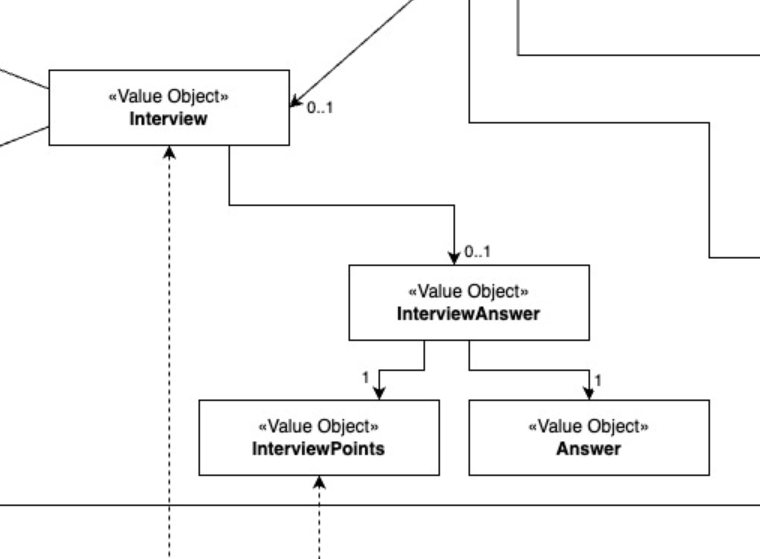

# US 1018

## 1. Context

This task, identifies as "US 1018", is part of the Customer Manager feature. The goal of this task is to allow the customer manager to execute the process of evaluation the interviews for a job opening.

## 2. Requirements

**1018** As Customer Manager, I want to execute the process that evaluates (grades) the
interviews for a job opening.

**Dependencies/References:**

This user story have some dependencies with the following user stories:

| US                                     | Reason                                                                                        |
|----------------------------------------|-----------------------------------------------------------------------------------------------|
| [1011](../../SprintB/us1011/readme.md) | The job opening must have a interview model made for evaluation.                              |
| [1017](../../SprintC/us1017/readme.md) | The job application of a job opening has an interview answer settled (not necessary for all). |

## 3. Analysis

- **The customer manager is able to execute the process of evaluation of interviews for a Job Opening.**

### 3.1. Client meeting

**Question (captured from US 1015):**

-  Deve ser executado o processo para todos os candidatos ou apenas para alguns (segundo algum critério)?

**Answer:**

-  Os ficheiros com as respostas aos requisitos vão entrando no sistema gradualmente. Talvez seja mais “simples” que o processo execute (ou seja, faça a verificação dos requisitos) para os candidatos para os quais já foi submetido o ficheiro de requisitos. Nalgum momento o processo irá executar com todos os candidatos já com os ficheiros de requisitos submetidos.

**Question:**

- No caso de upload de um ficheiro, se a pergunta que requer um número como resposta for preenchida com um formato inválido, por exemplo, uma letra, devemos considerar isso como um formato inválido na US 1017 (e pedir para o user voltar a dar upload a um ficheiro válido) ou devemos, na US1018, considerar que está incorreta e atribuir 0 pontos automaticamente para essa resposta inválida? Isto é, na US 1017, devemos apenas verificar o formato do ficheiro ou devemos verificar também se as respostas são preenchidas com o tipo de dados correto?

**Answer:**

- O caso mencionado deve ser considerado um erro de validação do ficheiro (ou seja, o ficheiro submetido não corresponde à gramática definida).

### 3.2. Business rules

- The job opening must be in interview phase.
- The process of execution of evaluation of interviews is only made in job applications with interview answers but without interview points.
- The evaluation of each interview must result in a value in a number with a range of 0-100 and is automatically settled on each job application.

### 3.3. System functionality

### 3.4. Domain model

- This use case changes the domain model, adding interivew points value object to the answer of interivew.

## 4. Design

### 4.1. Functionality

### 4.2. Class Diagram

### 4.3. Applied Patterns

In the development of this task, we utilized several design patterns to structure our code and ensure its
maintainability and scalability. These patterns include:

- **Repository Pattern:** The Repository pattern was used to create an abstraction layer between the data access layer
  and the business logic layer of the application. This helps to decouple the application and make it easier to maintain
  and test.
- **Service Pattern:** The Service pattern was used to encapsulate business logic and rules. This pattern provides a set of methods that any client application can use, and these methods implement the business rules and logic.
- **Controller Pattern:** The Controller pattern was used in the presentation layer of the application. Controllers
  handle incoming requests, manipulate data using the model, and select views to render to the user.

## 5. Implementation

he process of executing the process of evaluating interviews in this system involves several components working together. Here's a step-by-step
explanation

- **User Interface (ExecuteInterviewEvaluationUI.java)**: The process starts in the ExecuteInterviewEvaluationUI class, which is
  responsible for interacting
  with the user. It prompts the user to enter the necessary information.
  This class uses the ExecuteInterviewEvaluationController to handle the business logic.
- **Controller (ExecuteInterviewEvaluationController.java):** The ExecuteInterviewEvaluationController class is the bridge between the
  UI and the business
  logic.
- **Service (ExecuteInterviewEvaluationService.java):** The ExecuteInterviewEvaluationService class is where the business logic for execution the process of evaluating interviews resides.
- **Repository (JobOpeningRepository.java):** The JobOpeningRepository is an interface that defines the methods for
  interacting with the
  database. It extends the DomainRepository interface, which provides methods for basic CRUD operations.
- **Repository (JobApplicationRepository.java)**  The JobApplicationRepository is an interface that defines the methods for
  interacting with the
  database. It extends the DomainRepository interface, which provides methods for basic CRUD operations.

## 6. Demonstration

To demonstrate the implementation of this user story, we can use the following steps:

1. Start the application and log in as a customer manager.
2. Navigate to the application section and select the option to execute the process of evaluation of interviews.
3. Select the job opening that is in interview phase.