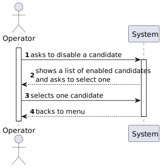
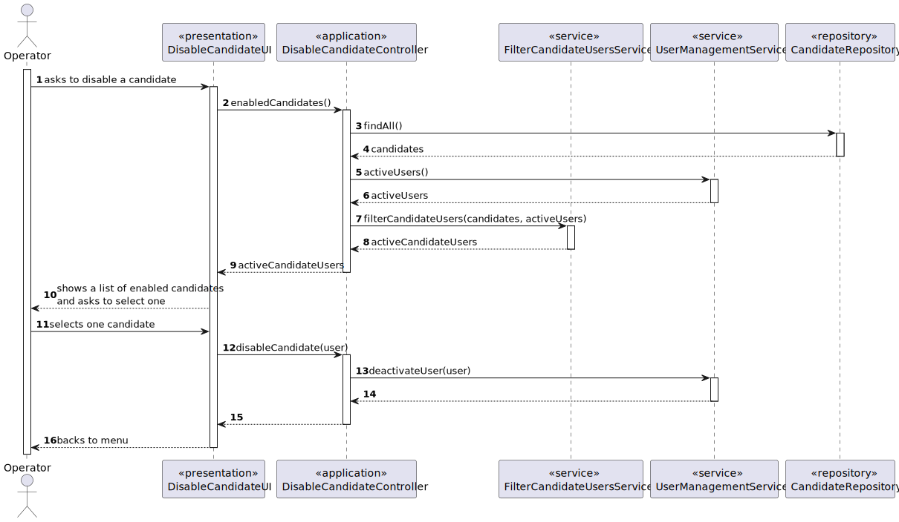
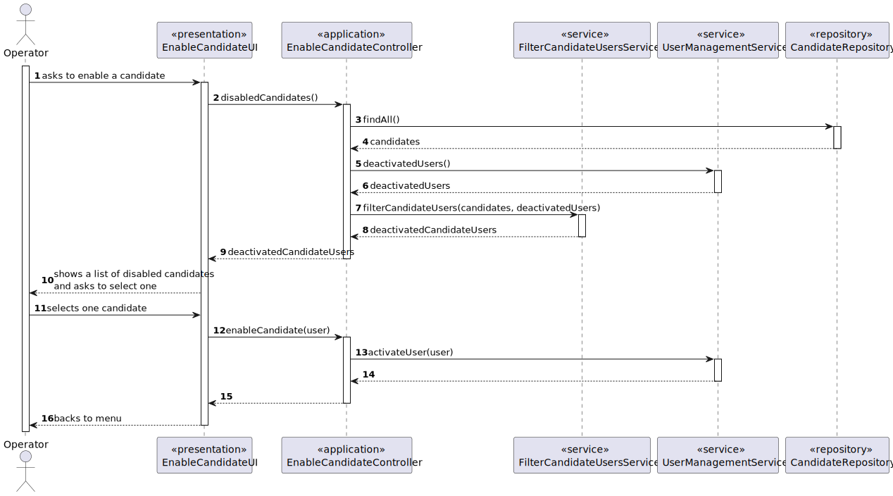

# US 2000b

## 1. Context

This task, identifies as "US 2000b", is part of the Operator feature. The goal of this task is to allow the operator to enable/disable a candidate from the his app (Candidate app).

This is the first task that is directly related to the rank feature of the system.

## 2. Requirements

**2000b** As Operator, I want to enable/disable a candidate.

**Dependencies/References:**

This user story have some dependencies with the following user stories:

| US                                      | Reason                                          |
|-----------------------------------------|-------------------------------------------------|
| [2000a](../../SprintB/us1002/readme.md) | The candidate must be registered in the system. |

## 3. Analysis

- **The operator, after registering the candidate in the system, is able to enable/disable him from his app (i.e. Candidate App).**

### 3.1. Client meeting

**Question:**

- A mudança de estado é referente ao candidato ou à candidatura individual e como se relaciona com o enable/disable dos utilizadores?

**Answer:**

- O enable/disable dos users é apenas para controlar os acessos ao sistema.

**Question:**

- O que é o enable/disable do candidato?

**Answer:**

- Refere-se a desativar o acesso do candidato ao sistema (i.e., Candidate App).

### 3.2. Business Rules

- The operator should select a candidate at a time.

### 3.3. System functionality

#### 3.3.1. Enable a candidate

#### 3.3.2. Disable a candidate

## 4. Design

### 4.1. Realization

#### 4.1.1. Disable a candidate

#### 4.1.2. Enable a candidate

### 4.2. Applied patterns

In the development of this task, we utilized several design patterns to structure our code and ensure its
maintainability and scalability. These patterns include:

- **Repository Pattern:** The Repository pattern was used to create an abstraction layer between the data access layer
  and the business logic layer of the application. This helps to decouple the application and make it easier to maintain
  and test.
- **Controller Pattern:** The Controller pattern was used in the presentation layer of the application. Controllers
  handle incoming requests, manipulate data using the model, and select views to render to the user.

